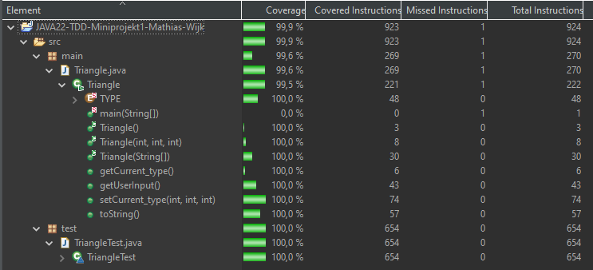

# JAVA22-TDD-Miniprojekt1-Mathias-Wijk

I början var jag osäker på hur jag skulle skriva mina tester men efter kollat igenom dem tester vi redan har skrivit kom jag på hur ska ska skriva testerna. Jag började först med toString där man skickar in en string array och testade alla möjliga kombinationer som jag kunde tänka mig. 
Jag hade kunna göra sammat tester på getCurrent_type men eftersom att det blir samma test som ska skrivas igen det inte är nödvändigt i detta exempel. 
När jag också gjorde tester så att nästan alla branches är täckta. 
Ett problem jag hade var också user input(scanner) i konsolen, men jag hittade en bra lösning som sätter ett värde i scannern/konsolen så att man inte behöver skriva i konsolen på varje test som använde konsolen.
Här är ett exempel på ett sådant test:
```java
void getUserInput_toStringCheckNotTriangle1() {
		String input = "0,2,3";
		ByteArrayInputStream inputStream = new ByteArrayInputStream(input.getBytes());
		System.setIn(inputStream);
		Triangle triangle = new Triangle();
		triangle.getUserInput();
		String result = triangle.toString();
		assertEquals("0, 2, 3, This is not a triangle", result);
		System.setIn(System.in);
	}
```

